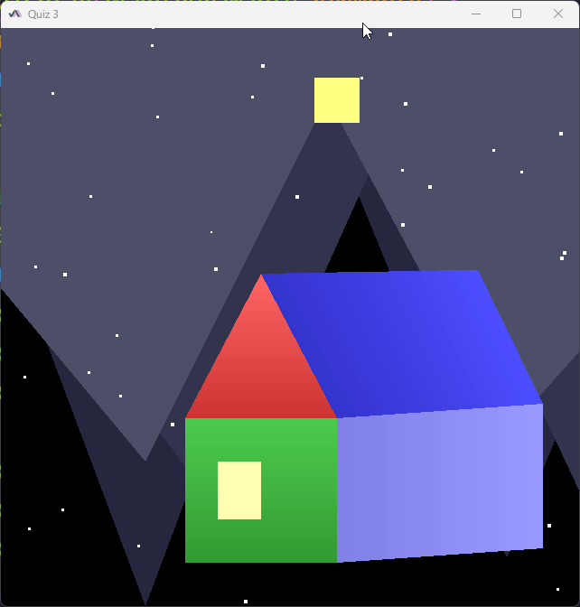

# Lab 1: การใช้งาน JOGL เบื้องต้น (Basic JOGL)

- ทำข้อ 1-3 ท้ายบท
- ข้อ 3 มีคะแนนความสวยงาม
- โบนัส ทดลองวาดรูปสี่เหลี่ยมโดยใช้ Line Loop
### 1. การวาดเส้น (Q1)

- การใช้ GL_LINES (เส้นสีแดง)
- การใช้ GL_LINE_STRIP (เส้นสีเขียว)
- การใช้ GL_LINE_LOOP (เส้นสีน้ำเงิน)
- การเพิ่มตัวอักษรกำกับจุด A-F

### 2. การวาดบ้าน (Q2)

- การวาดบ้านด้วย GL_LINE_LOOP
- การวาดบ้านด้วย GL_LINE_STRIP
- ส่วนประกอบ: หลังคา, ตัวบ้าน, ประตู, หน้าต่าง, ปล่องไฟ

### 3. การวาดรูปหลายเหลี่ยม (Q3)

- การใช้ GL_POLYGON วาดรูปสี่เหลี่ยมและสามเหลี่ยม
- การระบายสีพื้นที่ด้วยสีต่างๆ

### 4. ทดลองวาดรูปสี่เหลี่ยมโดยใช้ (QBonus)

