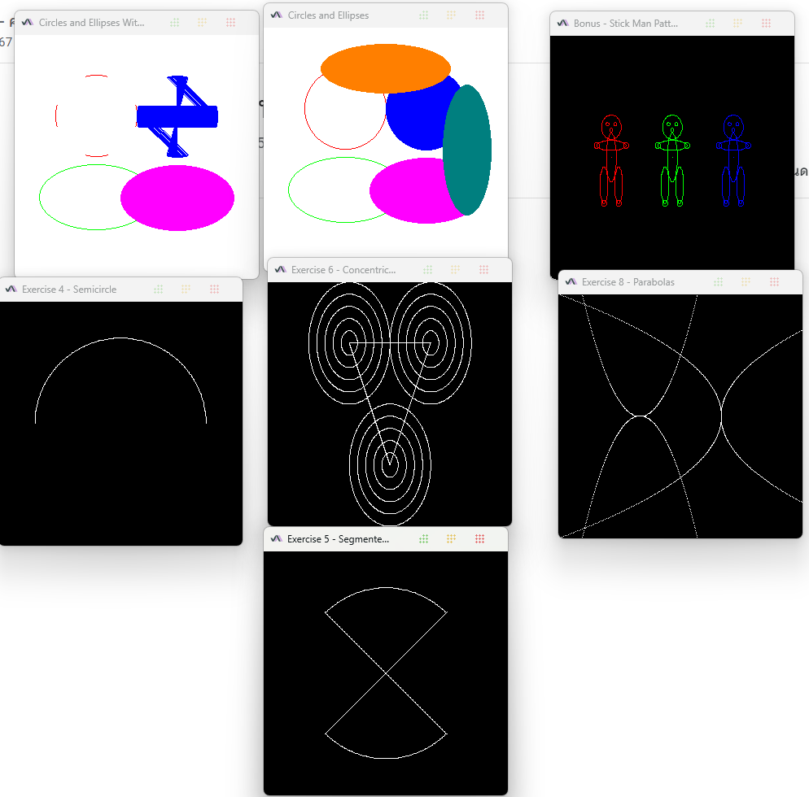

# Circle Drawing Lab

This project implements various circle and shape drawing algorithms using OpenGL in Java.

## Features

The project includes several exercises and implementations:

1. **Basic Circle Drawing** ([Cicles.java](src/Cicles.java))
   - Points and line-based circle drawing
   - Ellipse drawing with different methods

2. **Animated Circles** ([CiclesAnim.java](src/CiclesAnim.java))
   - Animated circle drawing demonstration
   - Progressive rendering of circles and ellipses

3. **Special Exercises**
   - Semicircle Drawing ([Exercise4.java](src/Exercise4.java))
   - Segmented Circle with X ([Exercise5.java](src/Exercise5.java))
   - Concentric Circles and Triangle ([Exercise6.java](src/Exercise6.java))

4. **Bonus Feature** ([Bonus.java](src/Bonus.java))
   - Stick Man Pattern using circles and ellipses

## Examples


## Project Structure

```
src/
├── App.java           - Main application entry point
├── Window.java        - Base window implementation
├── Cicles.java        - Basic circle implementations
├── CiclesAnim.java    - Animated circle drawing
├── Exercise4.java     - Semicircle implementation
├── Exercise5.java     - Circle with X pattern
├── Exercise6.java     - Concentric circles
└── Bonus.java         - Stick man pattern
```
